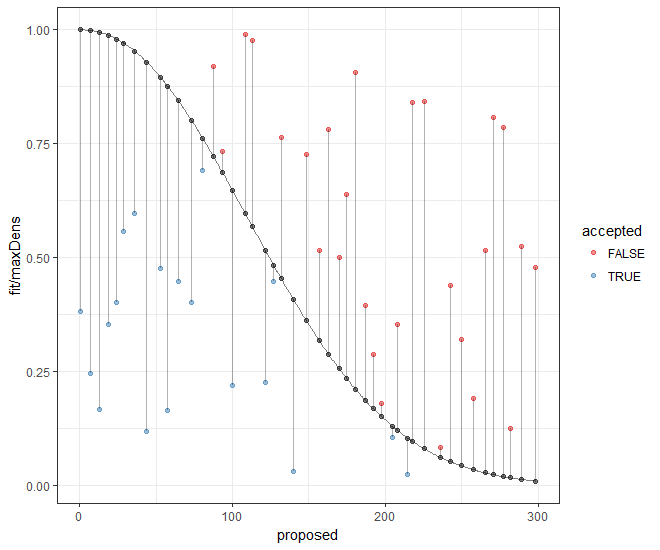

```{r setup, include=FALSE}
knitr::opts_chunk$set(echo = FALSE)
library(ggplot2)
```

## Motivacija

To gradivo v veliki meri črpam z bloga [Theoretical ecology](https://theoreticalecology.wordpress.com/2015/04/22/a-simple-explanation-of-rejection-sampling-in-r/), kjer je na sila preprost način predstavljen koncept in rešitev.

Denimo, da imamo porazdelitev, za katero v R-ju ni generične funkcije (kot na primer za normalno, Weibullovo, t porazdelitev...). Ker nimamo vseh pripravljenih orodij, ne moremo izračunati vseh lastnosti funkcije.

Iz te naše porazdelitve bi radi izračunali določen kvantil, ali pa bi radi nabral le vzorec. Ker je formula morda prekomplicirana, se lahko s problemom spopademo numerično.

## Naša porazdelitev {.smaller}

Denimo, da imamo porazdelitev

$f(x) = e^{-(\frac{x}{\sigma})^{-b}} \cdot c$

```{r echo = TRUE, fig.align = "right", fig.width = 5, fig.height = 4}
mojaFunkcija <- function(x, sigma, b, mx) {
  exp(-(x/sigma)^(-b)) * mx
}

sigma <- 100
b <- -2
mx = 15
```

##
```{r}
curve(mojaFunkcija(x, sigma = sigma, b = b, mx = mx), 
      from = 0, to = 300)
```

## Algoritem za vzorčenje

* izberi naključno točko `x` (~ Unif())
* za to točko `x` izračunaj vrednost funkcije `mojaFunkcija` -> testna vrednost
* za isto točko `x` vzorči naključno točko med 0 in največjo vrednostjo funkcije `mojaFunkcija` -> predlagana vrednost
* če je predlagana vrednost manjša (ali enaka) testni vrednosti, to točko obdržimo, sicer zavržemo

## Grafični prikaz algoritma za vzorčenje z zavračanjem

```{r out.height = "400px", out.width = "500px"}

```

## Implementacija algoritma /1

```{r echo = TRUE}
set.seed(357)
xrange <- 300 # from 0 (implicit) to x
N <- 50000 # number of samples

sigma <- 100
b <- -2
mx = 15

xy <- data.frame(x = runif(N, min = 0, max = xrange))

xy$testna <- mojaFunkcija(x = xy$x, sigma = sigma, b = b, mx = mx)
xy$predlagana <- runif(N, min = 0, max = mx)

xy$sprejeta <- with(xy, predlagana <= testna)
xy.OK <- xy[xy$sprejeta, ]
```

## Implementacija algoritma /2
```{r echo = TRUE}
MD <- max(xy$testna)
hist(xy.OK$x, freq = FALSE, breaks = 100, col = "light grey", 
     xlim = c(0, xrange))
curve(mojaFunkcija(x, sigma = sigma, b = b, mx = mx)/(MD * 90), 
      from = 0, to = xrange, add = TRUE, col = "red", lwd = 2)
```

## Koda za grafični prikaz

```{r echo = TRUE, eval = FALSE}
library(ggplot2)

set.seed(9)

xys <- xy[sample(1:nrow(xy), size = 200), ]
xys <- xys[order(xys$predlagana), ]
xys <- xys[seq(1, nrow(xys), by = 11), ]

ggplot(xy, aes(x = x, y = testna)) +
  theme_bw() +
  scale_color_brewer(palette = "Set1") +
  geom_line(alpha = 0.5) +
  geom_point(data = xys, aes(y = predlagana, color = sprejeta), 
             alpha = 0.5) +
  geom_point(data = xys, aes(x = x, y = testna), alpha = 0.5) +
  geom_segment(data = xys, aes(x = x, y = predlagana, xend = x, 
                               yend = testna), alpha = 0.3)
```

##
```{r echo = FALSE}
library(ggplot2)

set.seed(9)

xys <- xy[sample(1:nrow(xy), size = 200), ]
xys <- xys[order(xys$predlagana), ]
xys <- xys[seq(1, nrow(xys), by = 11), ]

ggplot(xy, aes(x = x, y = testna)) +
  theme_bw() +
  scale_color_brewer(palette = "Set1") +
  geom_line(alpha = 0.5) +
  geom_point(data = xys, aes(y = predlagana, color = sprejeta), 
             alpha = 0.5) +
  geom_point(data = xys, aes(x = x, y = testna), alpha = 0.5) +
  geom_segment(data = xys, aes(x = x, y = predlagana, xend = x, 
                               yend = testna), alpha = 0.3)
```