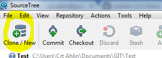
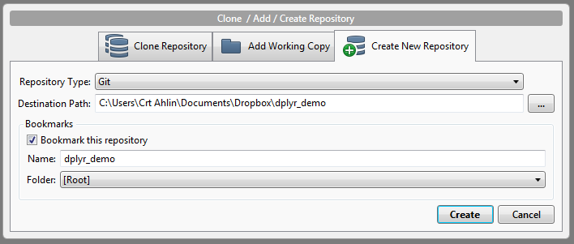
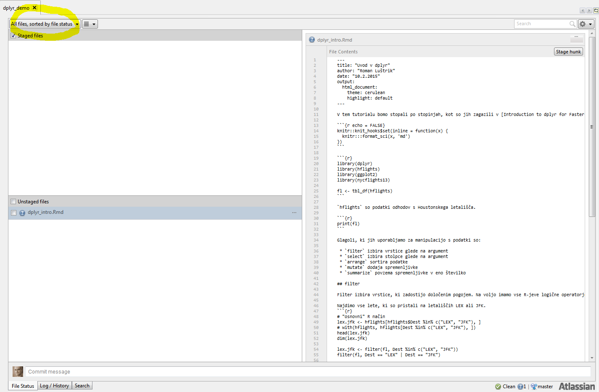
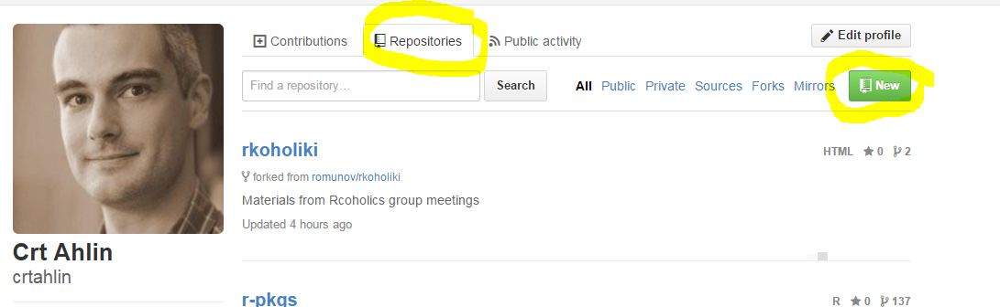
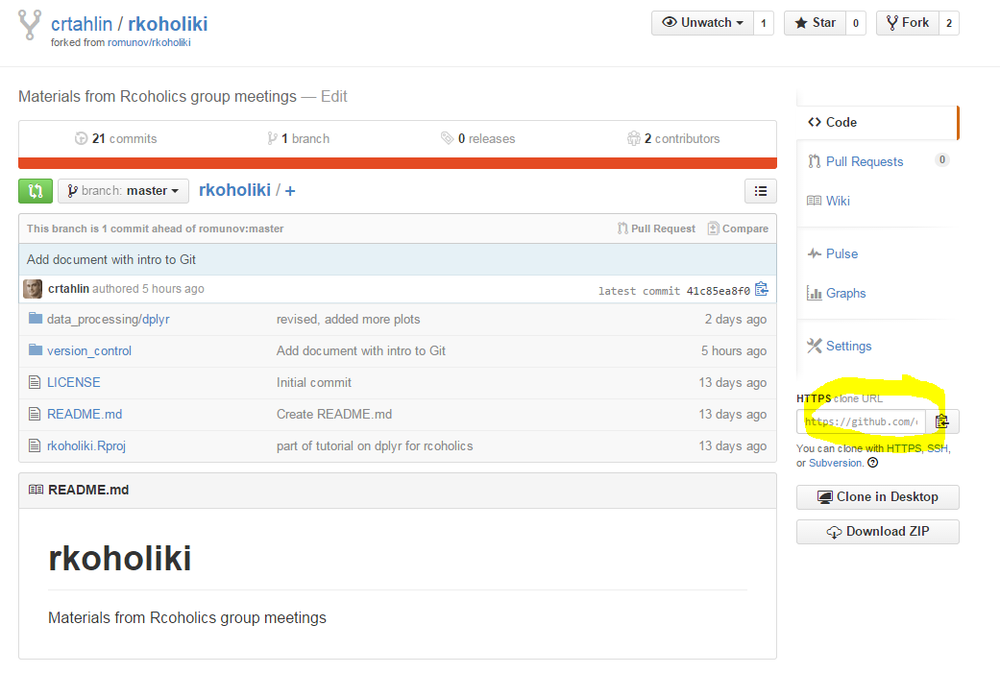
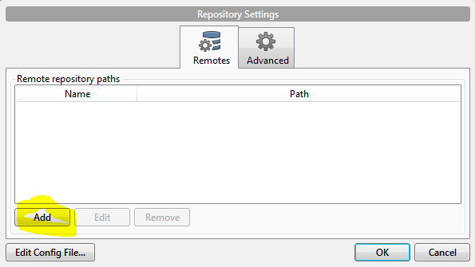
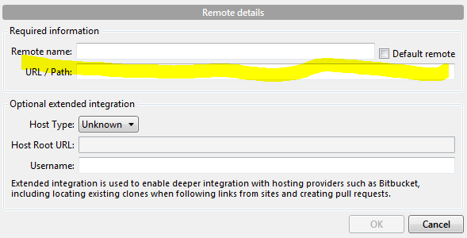
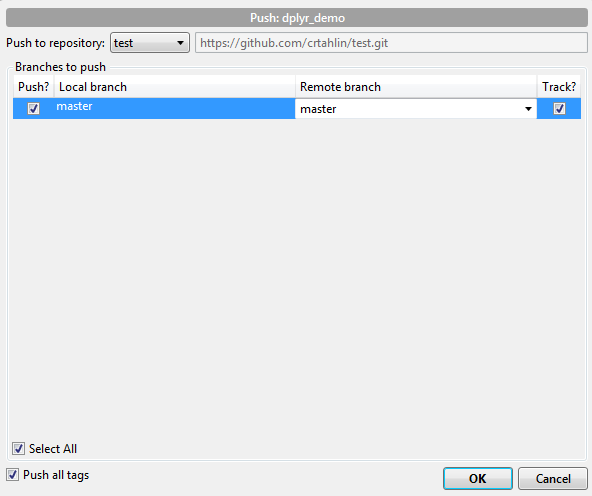

# Uvod

Pogledali bomo osnovni workflow v Git za enega uporabnika, ki želi imeti dostop do preteklih verzij dokumentov (predvsem mišljena koda računlaniških programov). Z Git bomo delali bomo s pomočjo grafičnega vmesnika SourceTree. Na koncu bomo izdelek "objavili" na GitHub.

Predpogoji za delo:

- osebni računalnik z Windows ali Mac OS
- instaliran [Git](http://git-scm.com/)
- instaliran [SourceTree](http://www.sourcetreeapp.com/)
- odprt uporabniški račun na [GitHub](https://github.com/)

# Uporaba

## Osnovni koncepti

Git je sistem za spremljanje verzij datotek, ki hrani vse pretekle verzije datotek, ki smo jih posebej "shranili" s pomočjo posebnega ukaza "commit". Vsa zgodovina je shranjena v (skriti) mapi imenovani ".git". Na disku je vedno vidna samo ena verzija datoteke - tista na kateri trenutno delamo. Do različnih verzij pridemo lahko s posebnimi ukazi, ki restavrirajo v aktivno mapo želeno verzijo. 

Ni nujno, da so vse datoteke v mapi pod kontrolo Git - moramo jih eksplicitno dodati. Dodane datoteke potem Git spremlja. Preden jih "commitamo", jih moramo najprej dodati v "staging area", kjer čakajo na naš "commit". Konkreten potek bo viden tekom dela.

## Pregled vmesnika SourceTree

- zgoraj meniji z večino (vsemi?) ukazov
- vrstica z ikonami, ki vsebuje pomembne ukaze (clone/new, commit, checkout, push)
- na levi meni s seznamom repositorijev
- na desni glavno okno s statusom datotek (zgodovina verzij, trenutno stanje datotek)

## Prvi commit

- odpremo SourceTree
- odpremo nov repo s "Clone/New" 

- izberemo "Create New Repository"; tip naj bo "Git"; "Destination Path" naj bo na lokalnem disku, kjer imamo kodo; "Name" naj bo poimenovanje projekta

- kliknemo "Create"

- če slučajno ne vidimo obstoječih datotek, izberemi prikaz "All files,..."

- dodamo datoteke v Staging area, tako da jih odkljukamo
- kliknemo "Commit" in vpišemo opis commita ter potrdimo z gumbom "Commit"

## Nadaljni commiti

Po vsaki primerni spremembi ponovimo koraka:

- dodamo datoteke v Staging area, tako da jih odkljukamo
- kliknemo "Commit" in vpišemo opis commita ter potrdimo z gumbom "Commit"

# Push na GitHub

Na GitHub moramo imeti odprt račun. Odpremo nov repositorij na zavihku "Repositories" s klikom na gumb "New".

Vpišemo ime novega repositorija in izpolnimo ostale nastavitve ter potrdimo. Ko je repo odprt, poiščemo nekje na desni strani link s https naslovom repositorija, ki ga potrebujemo za vzpostaviti povezavo s SourceTree.

V SourceTree izberemo "Repository -> Add Remote...". Odpre se okno, kjer kliknemo "Add".

V naslednjem oknu vpišemo želeno ime remote repositorija (npr. "origin" ali pa "github") ter v URL polje prekopiramo pridobljeni link.

Izpolnimo preostanek obrazca, večkrat potrdimo.

Kliknemo na ikono "Push" in zberemo, kateri branch želimo pushati in na kateri server. (V našem preprostem scenariju vedno samo en branch in en server.)

Potrdimo, preverimo na GitHub, če so vidne datoteke.
Za nadaljne "pushe" seveda ponovimo samo zadnja dva koraka.

# Uporabne povezave

- Preprost a pregleden začetniški tečaj o uporabi Git [How to Use Git and GitHub](https://www.udacity.com/course/ud775)
- [Git tuturial](http://git-scm.com/docs/gittutorial)